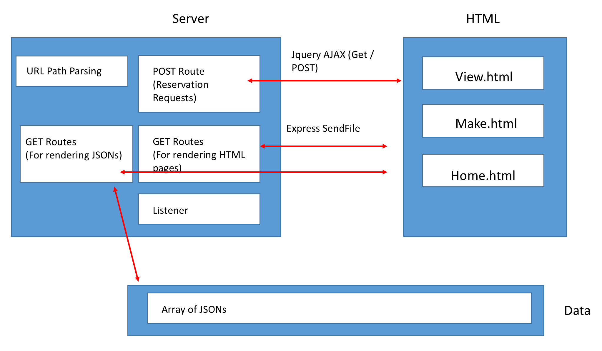

# HotRestaurant

## Description

Basic app demonstrating Node and Express with jQuery. Overall purpose is to help schedule reservation requests. Restaurant has just 5 tables available. First five requests get a reservation, every request after that is sent to the waiting list.

[Live Demo](https://reserve-restaurant.herokuapp.com/)

## Install
* npm i
* npm i express
* npm init -y

## Resources

- [Use ExpressJS to Get URL and POST Parameters](https://scotch.io/tutorials/use-expressjs-to-get-url-and-post-parameters)
- [Build a RESTful API Using Node and Express 4](https://scotch.io/tutorials/build-a-restful-api-using-node-and-express-4)
